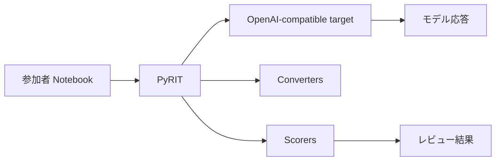

# PyRIT Red Teaming Hands-on

このハンズオンでは、PyRIT を使って生成 AI アプリケーションの安全性を確認する基本的な流れを体験します。

!!! important "この教材の前提"
    参加者は Azure アカウントを使いません。講師が一時的な OpenAI 互換エンドポイント、API キー、モデル名またはデプロイ名を配布します。

## なぜ PyRIT を使うのか

PyRIT は、AI Red Teaming を「その場でプロンプトを試す作業」から「再現できる評価プロセス」に近づけるためのフレームワークです。

- Target、Attack、Converter、Scorer などの部品に分けて整理できる
- 同じテストを複数のモデルやエンドポイントに対して繰り返しやすい
- プロンプト変換や攻撃パターンを体系的に試しやすい
- 応答やスコアを記録し、人間がレビューしやすい形にできる

このハンズオンでは、PyRIT のすべての機能を扱うのではなく、AI Red Teaming の基本的な流れを安全な題材で体験します。

## まず始める

Fork、Codespaces の起動、`mkdocs serve` の実行手順はリポジトリの README にまとめています。Workshop Guide を起動できたら、まず Setup で接続情報と Notebook の開き方を確認してください。

[Setup を開く](begin-here/00-setup.md){ .md-button .md-button--primary }
[Labs を見る](labs/index.md){ .md-button }

## このハンズオンで学ぶこと

- AI Red Teaming が何を確認する活動なのか
- PyRIT の Target、Converter、Attack、Scorer の役割
- 安全な架空シナリオでのプロンプト注入テスト
- 結果を自動判定だけでなく人間がレビューする理由

## 全体像

## 進め方

1. README に沿って Fork、Codespaces、`.env`、Workshop Guide を準備します。
2. Lab 0 でモデルエンドポイントへの接続を確認します。
3. Lab 1 で PyRIT の基本構成を触ります。
4. Lab 2 で安全なプロンプト注入シナリオを試します。
5. Lab 3 で結果をレビューします。
